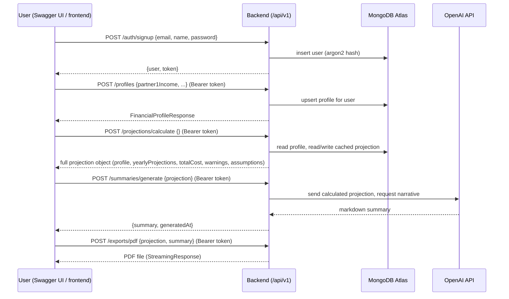

# Architecture

System overview for NestWorth. See `CLAUDE.md` for repo status, known issues, and the deployment history. See `DEPLOYMENT.md` for how the deployed stack is provisioned.

## Topology

```
Browser
  │
  ▼
Vercel (frontend/, React + Vite, static build)
  │  fetch() calls to API_BASE_URL (frontend/src/lib/api.ts)
  ▼
Railway (backend/, FastAPI + Uvicorn)
  │  Motor (async pymongo)
  ▼
MongoDB Atlas (users, profiles, projections collections)
  │
  ▼
OpenAI API (AI summary generation, backend/integrations/openai_client.py)
```

Frontend and backend are deployed independently and communicate only over HTTP(S); there is no server-side rendering or shared process.

## Backend structure

- `backend/main.py` — FastAPI app, router registration, `/healthz`
- `backend/routers/` — one file per resource, all mounted under `/api/v1`:
  - `auth.py` — `/api/v1/auth/signup`, `/login`, `/logout`, `/me`, `/forgot-password`, `/reset-password`
  - `profiles.py` — `/api/v1/profiles` (create/update), `/api/v1/profiles/me`
  - `projections.py` — `/api/v1/projections/calculate`
  - `summaries.py` — `/api/v1/summaries/generate`, `/generate-assumptions`
  - `exports.py` — `/api/v1/exports/pdf`
- `backend/models/` — Pydantic models (`user.py`, `profile.py`, `projection.py`)
- `backend/database.py` — Motor client / MongoDB connection
- `backend/integrations/openai_client.py` — OpenAI client construction (see `CLAUDE.md` Known Issues re: import-time construction requiring a non-empty `OPENAI_API_KEY`)
- `backend/config.py` — Pydantic settings, reads env vars
- `backend/scripts/` — one-off admin scripts (currently `delete_all_users.py`, requires `--yes`)
- `backend/tests/manual/` — ad hoc integration scripts that hit a live server; not a pytest suite (no fixtures/config)

## API documentation (Swagger / OpenAPI)

FastAPI auto-generates interactive API docs — no separate setup needed, and this has been true since `backend/main.py` first added the routers (`FastAPI(title="NestWorth API", ...)` doesn't override `docs_url`, so the defaults are live):

- **Swagger UI**: `<API_BASE_URL>/docs` — interactive, supports "Try it out" (click a route, click "Try it out", edit the pre-filled example body, click "Execute")
- **ReDoc**: `<API_BASE_URL>/redoc` — read-only, nicer for browsing
- **Raw OpenAPI schema**: `<API_BASE_URL>/openapi.json`

Locally that's `http://localhost:8000/docs`. Against the deployed backend, substitute the Railway URL (see `DEPLOYMENT.md`).

Every request model below has a `json_schema_extra` example wired into its Pydantic model (`backend/models/*.py`, `backend/routers/*.py`), so Swagger's "Try it out" pre-fills a working payload for signup, login, password reset, profile creation, and projection calculation — you can click Execute on the pre-filled body as-is. The two payload-heavy endpoints (`/summaries/generate`, `/exports/pdf`) intentionally don't have a synthetic example baked in, since their body is the exact JSON that `/projections/calculate` returns — see step 4 below for how to chain them.

## Auth flow

1. `POST /api/v1/auth/signup` or `/login` — backend hashes/verifies password with argon2, issues a JWT
2. Frontend stores the JWT (see `AuthContext.tsx`) and sends it as `Authorization: Bearer <token>` on subsequent requests
3. Protected routes use a FastAPI dependency to decode the JWT and load the current user
4. Password reset is token-based: `forgot-password` issues a token (returned in the API response only when `APP_ENV=development`), `reset-password` consumes `?token=...` from the URL — see `CLAUDE.md` Known Issues for the history of the insecure `-direct` endpoint that this replaced

## End-to-end API call sequence

This is the exact order the frontend calls the backend in, from a fresh signup through PDF download. All routes below except `/auth/signup` and `/auth/login` require `Authorization: Bearer <token>`.



1. **Sign up / log in** — `POST /api/v1/auth/signup` (or `/login` for a returning user) returns `{ "user": {...}, "token": "<jwt>" }`. In Swagger, click "Authorize" (top right) and paste `<jwt>` so subsequent "Try it out" calls carry it automatically.
2. **Create profile** — `POST /api/v1/profiles` persists the 10-question financial profile (upsert — one profile per user).
3. **Calculate projection** — `POST /api/v1/projections/calculate` reads the stored profile, looks up regional childcare costs and one-time/recurring cost tables, and returns a deterministic 5-year monthly/yearly projection with warnings (negative cashflow, low savings buffer, high childcare cost ratio). The response is cached in `projections` and reused until the profile is next updated.
4. **AI summary** — `POST /api/v1/summaries/generate` takes the **entire JSON object returned by step 3** as its `projection` field (not a subset — the endpoint 400s if `profile`, `yearlyProjections`, `totalCost`, `warnings`, or `assumptions` are missing) and sends it to OpenAI to produce an empathetic narrative; the model is constrained to the numbers already computed, not free to invent figures. `POST /api/v1/summaries/generate-assumptions` (optional, same auth) takes just the `assumptions` sub-object from step 3's response and returns a shorter assumptions-only summary.
5. **PDF export** — `POST /api/v1/exports/pdf` takes `{ "projection": <step 3's response>, "summary": <step 4's "summary" field> }` and returns a downloadable PDF.

### Trying steps 4–5 in Swagger

Because the payload for `/summaries/generate` and `/exports/pdf` is another endpoint's full response, the fastest way to play along in Swagger is to chain requests manually:

1. Run `/projections/calculate`, copy its entire response body.
2. Open `/summaries/generate`, paste the copied body as the value of `"projection"` in the request, and Execute.
3. Copy the `"summary"` string from that response.
4. Open `/exports/pdf`, paste the same projection body as `"projection"` and the copied string as `"summary"`, and Execute — the response is the PDF binary (Swagger offers a download link).

## Frontend reference data

`frontend/src/data/*.ts` (`childcareCostsByZip.ts`, `oneTimeCosts.ts`, `recurringCosts.ts`) are TypeScript tables compiled from the source spreadsheets in `data/` (`Example.xlsx`, `One Time costs.xlsx`, `Recurring costs.xlsx`, `Ref Data Childcare cost byZip.xlsx`). To update reference data, edit the spreadsheets and regenerate (or hand-edit) the corresponding `.ts` file; there is no automated spreadsheet→TS pipeline currently.

Two of these spreadsheets are also read directly at runtime on the backend, not just used as frontend provenance: `backend/data/childcare_loader.py` loads `data/Ref Data Childcare cost byZip.xlsx` and `backend/data/recurring_loader.py` loads `data/Recurring costs.xlsx` (both fall back to hardcoded defaults if the file is missing). `Example.xlsx` and `One Time costs.xlsx` are provenance-only — nothing in the app reads them at runtime.

## Known architectural gaps

See `CLAUDE.md` Known Issues for the full list (no rate limiting, `OPENAI_API_KEY` required at boot, no CI, etc.) — not duplicated here to avoid drift between the two documents.
