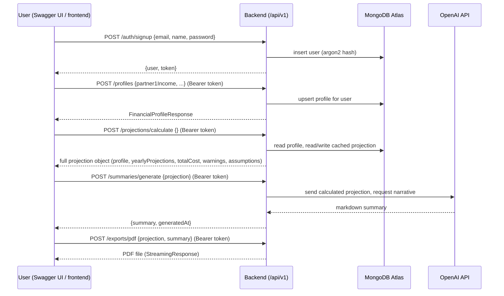

# NestWorth Snap

An AI-powered baby budget planning app that helps new and expecting parents understand the financial impact of having a baby by generating a comprehensive 5-year budget projection. React/Vite frontend + FastAPI/MongoDB backend.

See `CLAUDE.md` for full repo status, known issues, and deployment history.

## Features

- **User Authentication**: JWT-based registration and login backed by a FastAPI server (`backend/`), with argon2 password hashing
- **Financial Profile Onboarding**: Guided 10-question form to collect essential information
- **5-Year Financial Projection**: Deterministic calculation engine with year-by-year breakdown
- **Warning System**: Automated detection of cashflow issues and financial challenges
- **AI-Powered Summary**: Generated via the OpenAI API from the calculated projection data
- **PDF Export**: Server-generated PDF (reportlab) of the complete financial plan
- **Assumption Transparency**: Clear display of all assumptions used
- **Reference Data Tables**: Real cost data from national surveys and regional childcare databases

## Tech Stack

- **Frontend**: `frontend/` — React 18 + TypeScript + Vite (port 5137), Tailwind + shadcn/ui, React Router v6, React Context API, pnpm
- **Backend**: `backend/` — FastAPI + Motor (async MongoDB) + JWT auth (argon2 password hashing), OpenAI for AI summaries, reportlab for PDF export
- **Database**: MongoDB Atlas (cloud) — no local Mongo fallback configured

## Running locally

### Prerequisites

- Python 3.11+
- Node.js + [pnpm](https://pnpm.io/) 10+
- A MongoDB Atlas connection string (or other MongoDB URI) — no local Mongo fallback is configured
- An OpenAI API key (required just to boot the backend — see note below)

### Backend

Run from the **repo root**, not `backend/` — the app uses absolute imports (`from backend.config import settings`) that only resolve with the repo root as the working directory.

```powershell
python -m venv venv
.\venv\Scripts\Activate.ps1
pip install -r backend/requirements.txt
uvicorn backend.main:app --reload --port 8000
```

Copy `backend/.env.example` to `backend/.env` and fill in `MONGODB_URI`, `JWT_SECRET`, and `OPENAI_API_KEY`.

**Note:** the OpenAI client is constructed at module import time, so an empty/missing `OPENAI_API_KEY` crashes the whole app on startup, not just AI-summary requests (see `CLAUDE.md` Known issues). If you don't have a real key yet, a syntactically plausible dummy (e.g. `sk-test-dummy`) lets the app boot — AI-summary requests will just fail with an auth error.

Verify it's running:
- `http://localhost:8000/healthz` — health check (also confirms Mongo connectivity; check console logs, since a Mongo issue logs a warning rather than crashing)
- `http://localhost:8000/docs` — Swagger UI

### Frontend

In a separate terminal, from `frontend/`:

```powershell
pnpm install
pnpm dev
```

Runs at `http://localhost:5137`.

If `pnpm install` pauses on an interactive "Choose which packages to build" prompt (this happens the first time pnpm encounters packages like `@swc/core`/`esbuild` that ship native build scripts), press `a` to select all, then Enter — or run `pnpm approve-builds` directly. This is normal pnpm 10+ behavior, not an error.

The frontend defaults to talking to `http://localhost:8000` (see `frontend/src/lib/api.ts`). Only create `frontend/.env` (from `frontend/.env.example`) if you need to point it elsewhere.

## Usage

1. **Register**: Create a new account with email, name, and password
2. **Onboarding**: Complete the 3-step financial profile form (≤10 questions)
3. **View Results**: See your 5-year projection with year-by-year breakdown
4. **Review Warnings**: Check for any financial challenges or cashflow issues
5. **Read AI Summary**: Get an empathetic explanation of your financial situation
6. **Download PDF**: Export your complete financial plan
7. **Edit Inputs**: Update your profile to regenerate projections

## Architecture

System overview for NestWorth. See `CLAUDE.md` for repo status, known issues, and the deployment history.

### Topology

```
Browser
  │
  ▼
Vercel (frontend/, React + Vite, static build)
  │  fetch() calls to API_BASE_URL (frontend/src/lib/api.ts)
  ▼
Railway (backend/, FastAPI + Uvicorn)
  │  Motor (async pymongo)
  ▼
MongoDB Atlas (users, profiles, projections collections)
  │
  ▼
OpenAI API (AI summary generation, backend/integrations/openai_client.py)
```

Frontend and backend are deployed independently and communicate only over HTTP(S); there is no server-side rendering or shared process.

### Backend structure

- `backend/main.py` — FastAPI app, router registration, `/healthz`
- `backend/routers/` — one file per resource, all mounted under `/api/v1`:
  - `auth.py` — `/api/v1/auth/signup`, `/login`, `/logout`, `/me`, `/forgot-password`, `/reset-password`
  - `profiles.py` — `/api/v1/profiles` (create/update), `/api/v1/profiles/me`
  - `projections.py` — `/api/v1/projections/calculate`
  - `summaries.py` — `/api/v1/summaries/generate`, `/generate-assumptions`
  - `exports.py` — `/api/v1/exports/pdf`
- `backend/models/` — Pydantic models (`user.py`, `profile.py`, `projection.py`)
- `backend/database.py` — Motor client / MongoDB connection
- `backend/integrations/openai_client.py` — OpenAI client construction (see `CLAUDE.md` Known Issues re: import-time construction requiring a non-empty `OPENAI_API_KEY`)
- `backend/config.py` — Pydantic settings, reads env vars
- `backend/scripts/` — one-off admin scripts (currently `delete_all_users.py`, requires `--yes`)
- `backend/tests/manual/` — ad hoc integration scripts that hit a live server; not a pytest suite (no fixtures/config)

### Frontend project structure

```
frontend/src/
├── components/        # Reusable UI components (shadcn/ui)
├── contexts/          # React contexts (AuthContext)
├── data/             # Reference data tables
│   ├── childcareCostsByZip.ts    # Weekly childcare costs by ZIP
│   ├── oneTimeCosts.ts           # One-time baby expenses
│   └── recurringCosts.ts         # Monthly recurring expenses
├── pages/            # Page components
│   ├── Login.tsx
│   ├── Register.tsx
│   ├── Onboarding.tsx
│   └── Results.tsx
├── types/            # TypeScript interfaces
│   └── financial.ts
├── utils/            # Utility functions
│   ├── expenseAssumptions.ts    # Cost calculation logic
│   ├── projectionCalculator.ts  # Calculation engine
│   └── aiSummaryGenerator.ts    # Template-based summaries
└── App.tsx           # Main app component with routing
```

### API documentation (Swagger / OpenAPI)

FastAPI auto-generates interactive API docs — no separate setup needed, and this has been true since `backend/main.py` first added the routers (`FastAPI(title="NestWorth API", ...)` doesn't override `docs_url`, so the defaults are live):

- **Swagger UI**: `<API_BASE_URL>/docs` — interactive, supports "Try it out" (click a route, click "Try it out", edit the pre-filled example body, click "Execute")
- **ReDoc**: `<API_BASE_URL>/redoc` — read-only, nicer for browsing
- **Raw OpenAPI schema**: `<API_BASE_URL>/openapi.json`

Locally that's `http://localhost:8000/docs`. Against the deployed backend, substitute the Railway URL (see Deployment below).

Every request model has a `json_schema_extra` example wired into its Pydantic model (`backend/models/*.py`, `backend/routers/*.py`), so Swagger's "Try it out" pre-fills a working payload for signup, login, password reset, profile creation, and projection calculation — you can click Execute on the pre-filled body as-is. The two payload-heavy endpoints (`/summaries/generate`, `/exports/pdf`) intentionally don't have a synthetic example baked in, since their body is the exact JSON that `/projections/calculate` returns — see below for how to chain them.

### Auth flow

1. `POST /api/v1/auth/signup` or `/login` — backend hashes/verifies password with argon2, issues a JWT
2. Frontend stores the JWT (see `AuthContext.tsx`) and sends it as `Authorization: Bearer <token>` on subsequent requests
3. Protected routes use a FastAPI dependency to decode the JWT and load the current user
4. Password reset is token-based: `forgot-password` issues a token (returned in the API response only when `APP_ENV=development`), `reset-password` consumes `?token=...` from the URL — see `CLAUDE.md` Known Issues for the history of the insecure `-direct` endpoint that this replaced

### End-to-end API call sequence

This is the exact order the frontend calls the backend in, from a fresh signup through PDF download. All routes below except `/auth/signup` and `/auth/login` require `Authorization: Bearer <token>`.



1. **Sign up / log in** — `POST /api/v1/auth/signup` (or `/login` for a returning user) returns `{ "user": {...}, "token": "<jwt>" }`. In Swagger, click "Authorize" (top right) and paste `<jwt>` so subsequent "Try it out" calls carry it automatically.
2. **Create profile** — `POST /api/v1/profiles` persists the 10-question financial profile (upsert — one profile per user).
3. **Calculate projection** — `POST /api/v1/projections/calculate` reads the stored profile, looks up regional childcare costs and one-time/recurring cost tables, and returns a deterministic 5-year monthly/yearly projection with warnings (negative cashflow, low savings buffer, high childcare cost ratio). The response is cached in `projections` and reused until the profile is next updated.
4. **AI summary** — `POST /api/v1/summaries/generate` takes the **entire JSON object returned by step 3** as its `projection` field (not a subset — the endpoint 400s if `profile`, `yearlyProjections`, `totalCost`, `warnings`, or `assumptions` are missing) and sends it to OpenAI to produce an empathetic narrative; the model is constrained to the numbers already computed, not free to invent figures. `POST /api/v1/summaries/generate-assumptions` (optional, same auth) takes just the `assumptions` sub-object from step 3's response and returns a shorter assumptions-only summary.
5. **PDF export** — `POST /api/v1/exports/pdf` takes `{ "projection": <step 3's response>, "summary": <step 4's "summary" field> }` and returns a downloadable PDF.

#### Trying steps 4–5 in Swagger

Because the payload for `/summaries/generate` and `/exports/pdf` is another endpoint's full response, the fastest way to play along in Swagger is to chain requests manually:

1. Run `/projections/calculate`, copy its entire response body.
2. Open `/summaries/generate`, paste the copied body as the value of `"projection"` in the request, and Execute.
3. Copy the `"summary"` string from that response.
4. Open `/exports/pdf`, paste the same projection body as `"projection"` and the copied string as `"summary"`, and Execute — the response is the PDF binary (Swagger offers a download link).

### Frontend reference data

`frontend/src/data/*.ts` (`childcareCostsByZip.ts`, `oneTimeCosts.ts`, `recurringCosts.ts`) are TypeScript tables compiled from the source spreadsheets in `data/` (`Example.xlsx`, `One Time costs.xlsx`, `Recurring costs.xlsx`, `Ref Data Childcare cost byZip.xlsx`). To update reference data, edit the spreadsheets and regenerate (or hand-edit) the corresponding `.ts` file; there is no automated spreadsheet→TS pipeline currently.

Two of these spreadsheets are also read directly at runtime on the backend, not just used as frontend provenance: `backend/data/childcare_loader.py` loads `data/Ref Data Childcare cost byZip.xlsx` and `backend/data/recurring_loader.py` loads `data/Recurring costs.xlsx` (both fall back to hardcoded defaults if the file is missing). `Example.xlsx` and `One Time costs.xlsx` are provenance-only — nothing in the app reads them at runtime.

### Known architectural gaps

See `CLAUDE.md` Known Issues for the full list (no rate limiting, `OPENAI_API_KEY` required at boot, no CI, etc.) — not duplicated here to avoid drift.

## Application internals

Deeper detail on the frontend's reference data tables and calculation engine (`frontend/src/utils/`, `frontend/src/data/`).

### Reference Data Tables

The application uses three reference data tables for accurate cost calculations:

#### 1. Childcare Costs by ZIP Code
**File**: `frontend/src/data/childcareCostsByZip.ts`

Contains weekly childcare costs by ZIP code, including:
- Infant care costs (0-12 months)
- Toddler care costs (12-36 months)
- Preschool care costs (3-5 years)
- State and city information

**Data Source**: National childcare cost surveys and regional databases

**Usage**:
- Automatically looks up costs based on user's ZIP code
- Falls back to national averages if ZIP not found
- Converts weekly costs to monthly (multiply by 4.33)

#### 2. One-Time Expenses
**File**: `frontend/src/data/oneTimeCosts.ts`

Contains one-time baby expenses with low/average/high cost ranges:
- **Nursery Furniture**: Crib, mattress, changing table, dresser, glider
- **Transportation**: Car seat, stroller, baby carrier
- **Feeding**: High chair, bottles, breast pump
- **Safety**: Baby monitor, gates
- **Bathing**: Baby bathtub
- **Other**: Diaper bag, play mat, swing/bouncer

**Cost Levels**:
- **Low**: Budget-friendly options
- **Average**: Mid-range quality
- **High**: Premium brands

#### 3. Recurring Monthly Expenses
**File**: `frontend/src/data/recurringCosts.ts`

Contains age-based monthly expenses with low/average/high ranges:
- **Diapers & Wipes**: Decreases after potty training (~30 months)
- **Formula & Food**: Formula (0-12 months), baby food (6-12 months), toddler food (12+ months)
- **Clothing**: Size-based costs that increase with age
- **Healthcare**: Co-pays, medications, dental care
- **Personal Care**: Bath products, extra laundry
- **Toys & Books**: Age-appropriate items
- **Miscellaneous**: Unexpected expenses

**Age-Based Logic**:
- Each expense has a `startMonth` (when it begins)
- Optional `endMonth` (when it stops, e.g., formula at 12 months)
- Costs automatically adjust as baby grows

### Calculation Engine

The projection calculator is **deterministic** - same inputs always produce identical results.

#### Core Functions

1. **`getBabyExpenseAssumptions(profile)`**
   - Looks up childcare costs by ZIP code from reference data
   - Determines cost band (low/medium/high) based on regional childcare costs
   - Retrieves one-time costs from reference table
   - Gets age-appropriate recurring costs from reference table
   - Returns complete expense assumptions

2. **`calculateFiveYearProjection(profile)`**
   - Generates 60 monthly projections (5 years)
   - Accounts for parental leave income reduction
   - Calculates age-based expenses using reference data
   - Tracks cumulative savings
   - Aggregates into yearly summaries

3. **`generateWarnings(projection)`**
   - Detects negative cashflow months
   - Identifies low savings buffer
   - Flags high childcare costs (>30% of income)
   - Provides actionable recommendations

4. **`generateAISummary(projection)`**
   - Creates empathetic narrative using calculated data
   - **Does not invent any numbers**
   - Highlights key insights and warnings
   - Includes legal disclaimers

#### Cost Band Determination

The system automatically determines cost level based on childcare costs:
- **Low**: Weekly infant care < $280
- **Medium**: Weekly infant care $280-$400
- **High**: Weekly infant care > $400

This cost band is then applied to one-time and recurring expenses.

#### Example Cost Calculations

**High-Cost Area (NYC, ZIP 10001)**
- Weekly infant daycare: $450 → Monthly: $1,949
- One-time costs: High range (e.g., crib $800)
- Recurring costs: High range (e.g., diapers $120/mo)

**Medium-Cost Area (Chicago, ZIP 60601)**
- Weekly infant daycare: $350 → Monthly: $1,516
- One-time costs: Average range (e.g., crib $300)
- Recurring costs: Average range (e.g., diapers $80/mo)

**Low-Cost Area (Birmingham, ZIP 35004)**
- Weekly infant daycare: $240 → Monthly: $1,039
- One-time costs: Low range (e.g., crib $150)
- Recurring costs: Low range (e.g., diapers $60/mo)

#### Age-Based Cost Changes

The calculator automatically adjusts costs as baby grows:

- **Month 0-6**: Formula, diapers, newborn clothes, basic healthcare
- **Month 6-12**: Add baby food, reduce formula, childcare starts
- **Month 12-24**: Stop formula, increase food costs, toddler clothes
- **Month 24-36**: Potty training (reduce diapers), preschool clothes
- **Month 36-60**: No diapers, increased food/clothing, preschool activities

### Data Models

#### UserFinancialProfile
```typescript
{
  userId: string;
  partner1Income: number;
  partner2Income: number;
  zipCode: string;
  dueDate: string;
  currentSavings: number;
  childcarePreference: 'daycare' | 'nanny' | 'stay-at-home';
  partner1Leave: { durationWeeks: number; percentPaid: number };
  partner2Leave: { durationWeeks: number; percentPaid: number };
  monthlyHousingCost: number;
}
```

#### FiveYearProjection
```typescript
{
  profile: UserFinancialProfile;
  assumptions: ExpenseAssumptions;
  monthlyProjections: MonthlyProjection[];
  yearlyProjections: YearlyProjection[];
  totalCost: number;
  warnings: Warning[];
  generatedAt: string;
}
```

### Updating Reference Data

To update the reference data tables:

1. **Childcare Costs**: Edit `frontend/src/data/childcareCostsByZip.ts`
   - Add new ZIP codes with weekly costs
   - Update existing costs based on new surveys

2. **One-Time Costs**: Edit `frontend/src/data/oneTimeCosts.ts`
   - Add new items or categories
   - Update price ranges based on market research

3. **Recurring Costs**: Edit `frontend/src/data/recurringCosts.ts`
   - Add new expense categories
   - Adjust age ranges and costs
   - Update start/end months for expenses

The calculation engine will automatically use the updated data.

### Future Enhancements

The codebase is structured to easily add:

1. **Expanded Reference Data**
   - More comprehensive ZIP code coverage
   - Regional price variations for all categories
   - Seasonal cost adjustments

2. **Scenario Modeling**
   - Compare different childcare options
   - Model income changes
   - Test different savings strategies

3. **Tax Planning**
   - Child Tax Credit calculations
   - Dependent Care FSA optimization
   - State-specific tax benefits

4. **Healthcare Costs**
   - Insurance premium changes
   - Deductible tracking
   - HSA/FSA planning

5. **Multi-Child Support**
   - Track multiple children
   - Sibling cost adjustments
   - Family planning scenarios

6. **Expense Tracking**
   - Compare actual vs projected
   - Budget variance analysis
   - Spending insights

(Backend persistence and OpenAI-powered summaries are already implemented — see `backend/`.)

### Important Notes

- **Backend-Backed**: Auth and all financial data persist in MongoDB Atlas via `backend/`, not localStorage
- **Real Authentication**: JWT tokens, argon2-hashed passwords
- **AI Summary**: Generated via the OpenAI API from the calculated projection (see `backend/integrations/openai_client.py`)
- **Reference Data**: Based on national surveys and regional databases
- **Cost Variations**: Actual costs vary by location, choices, and circumstances
- **Not Financial Advice**: Always includes disclaimers
- This is a prototype — see `CLAUDE.md` for known issues (security, deployment) before exposing it beyond localhost

## Deployment

**Stack: Vercel (frontend) + Railway (backend) + MongoDB Atlas (DB), all on free/hobby tiers.**

Status: fully live as of 2026-08-03 (frontend on Vercel, backend on Railway connected to Atlas, CORS configured, end-to-end smoke test passed). This section covers how to reproduce or redeploy the stack. See `CLAUDE.md`'s Deployment plan section for the full failure-by-failure history if a redeploy regresses any of the issues below — this only states the working configuration.

### 1. MongoDB Atlas

1. Create a free (M0) cluster.
2. Create a database user with a strong password.
3. Under **Network Access**, allow `0.0.0.0/0`.
   - Atlas rejects connections from non-allowlisted IPs with a generic TLS handshake failure (`TLSV1_ALERT_INTERNAL_ERROR`), not a timeout — if you see that error, check this first, before suspecting OpenSSL/runtime issues.
4. Copy the connection string for `MONGODB_URI`.

### 2. Railway backend

- **Root Directory**: repo root — **do not** point it at `backend/`. The app uses absolute imports (`from backend.config import settings`), which only resolve with the repo root as the working directory and `backend/` as a package.
- Build/deploy config lives in two files at the repo root:
  - `nixpacks.toml` — declares `nixPkgs` (`python311`, `stdenv.cc.cc.lib` for `libstdc++.so.6` needed by pandas/numpy), creates a venv at `/opt/venv`, installs `backend/requirements.txt` into it (working around Nix's PEP 668 externally-managed-environment restriction), and starts uvicorn with `LD_LIBRARY_PATH` appended (not prepended — prepending Nix's lib dir ahead of the system path risks shadowing the OpenSSL Python's `_ssl` module was built against, which manifests as the same Atlas TLS alert described above).
  - `railway.json` — deploy-level settings only (`healthcheckPath: /healthz`, `restartPolicyType`). Build config stays entirely in `nixpacks.toml`.
- Swagger UI is available at `<railway-url>/docs` with no extra config (FastAPI's default docs route is never disabled) — useful for smoke-testing the deployed API directly. See the Architecture section above ("API documentation" and "End-to-end API call sequence") for the request order and copy-paste payloads.
- Required environment variables:
  - `MONGODB_URI`
  - `JWT_SECRET`
  - `CORS_ORIGINS` (comma-separated; must include the live Vercel URL)
  - `OPENAI_API_KEY` (required at boot — see `CLAUDE.md` Known Issues; an empty value crashes the app on import, not just AI-summary requests)
  - `APP_ENV=production`
  - `PORT` is injected automatically by Railway; `railway.json`'s start command reads it.
- **Debugging a failed healthcheck**: Railway's healthcheck retry panel only shows pass/fail, never the actual error. Check the service's **Deploy Logs** tab (separate from Build Logs) for the real stdout/stderr, including Python tracebacks. If every attempt fails identically (not intermittently), that means the process crashed before binding to a port — check Deploy Logs first.

### 3. Vercel frontend

- Import `frontend/` as the **project root** (not the repo root).
- Set `VITE_API_BASE_URL` to the Railway backend's public URL.
- `frontend/vercel.json` provides the SPA rewrite rule.

### 4. Wire them together

1. Deploy backend first, note its public Railway URL.
2. Set `VITE_API_BASE_URL` on Vercel to that URL, deploy frontend, note its public Vercel URL.
3. Set `CORS_ORIGINS` on Railway to the Vercel URL, redeploy backend.
4. Smoke-test end-to-end: signup, login, complete onboarding, view projection, generate AI summary, download PDF.

### Known deployment risks (unresolved)

See `CLAUDE.md` Known Issues for the current list (no rate limiting, `OPENAI_API_KEY` required at boot, no CI/Dockerfile, `APP_ENV` must never be `development` outside a dev machine). Don't duplicate that list here — check `CLAUDE.md` for the live version.

## License

MIT

## Contributing

Contributions welcome for:
- More comprehensive ZIP code database
- Updated cost data from recent surveys
- Additional expense categories
- Improved cost calculation logic
- Enhanced PDF export styling
